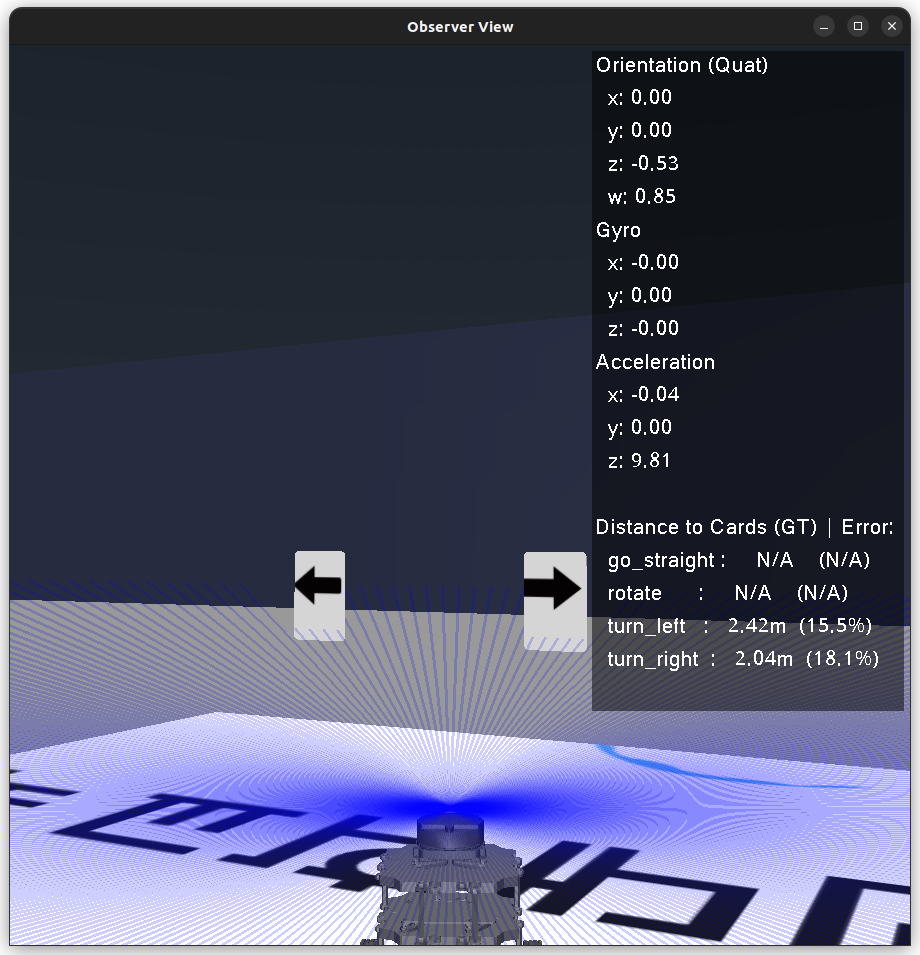
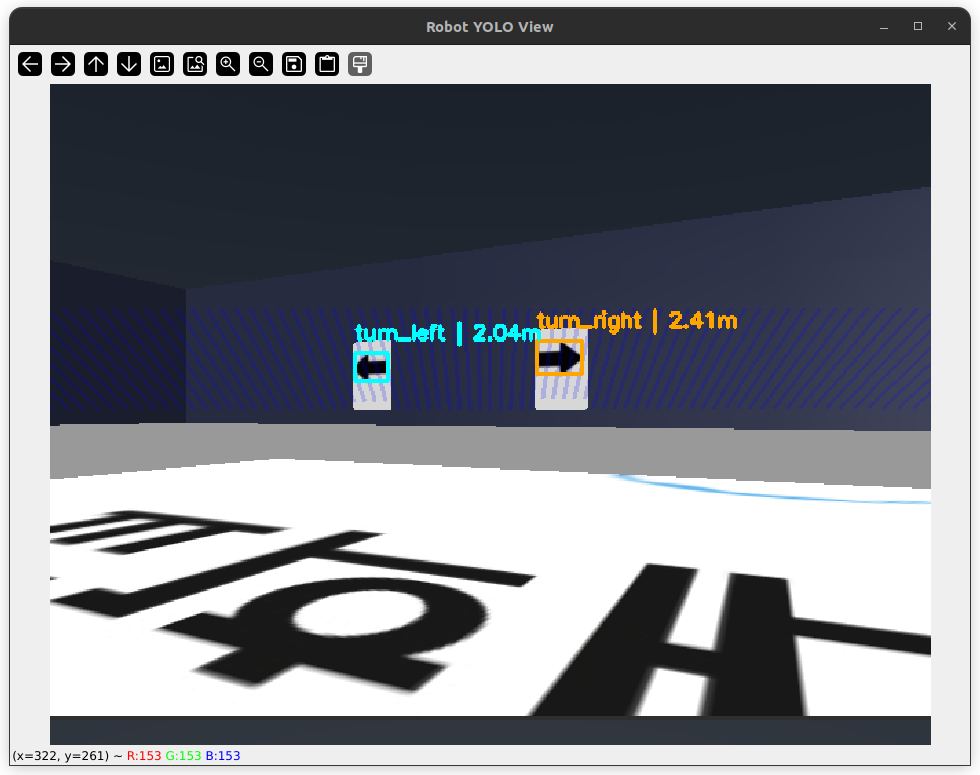

# 26-1 [UROP] Prologue : MuJoCo + LLM 실습 [WEEK 3]

### VLA 실습 II : 센서 인지 기반 VLA (Team Project) (01.05 ~ 01.11)

Tech Stack: MuJoCo + YOLOv11 + Sensor Data (LiDAR / IMU 등) + SmolVLA (OpenVLA 경량화 모델)

Mission: MuJoCo 시뮬레이션 환경에서 로봇의 시각 정보뿐만 아니라 **센서 데이터**를 함께 입력으로 **활용**해, LLM이 더 풍부한 환경 인식을 바탕으로 의사결정을 수행하도록 VLA 구조를 확장

Key Focus: 시각 정보 중심 VLA → **멀티 센서 기반 VLA**로 확장

* 센서 데이터를 프롬프트 또는 구조화된 입력으로 변환
* LLM이 센서 상태까지 고려해 행동을 선택하도록 설계
* 팀 단위로 설계·실험·분석 수행

### 3조 실습 진행 내용
Rangefinder (LiDAR) sensordata를 활용한 로봇과 물체 사이 거리 측정
* `tb3_sim.py/get_ground_truth_distance` : 로봇과 물체의 좌표 차이로 실제 거리 계산
* `tb3_sim.py/get_dist_to_target` : LiDAR에서 받아온 sensordata로 거리 계산
* **두 메서드 간의 출력을 비교**해가며 LiDAR로 정확한 거리 측정하는 방법 학습

카드 이미지 변경
* YOLO fine-tuning 진행
* 카드에 따른 동작 (turn_left, turn_right, rotate, go_straight) 로봇에게 학습 시도 (TBD)

프롬프트 수정
* 카드와의 거리에 대한 답변 규칙 추가
* turtlebot(burger) 최대 속도로 계산한 카드 도달까지의 시간 답변 규칙 추가

LiDAR 센서 parameter 수정
* 먼 거리에서도 카드 탐지 가능하도록 rangefinder cutoff를 3.0에서 15.0로 변경

GUI에 거리 모니터링 추가
* `utils/mujoco_renderer.py` : Observer View GUI에 실제 거리 추가
* `tb3_sim.py/_run_yolo_on_latest_frame` : YOLO View GUI에 LiDAR 측정 거리 추가

